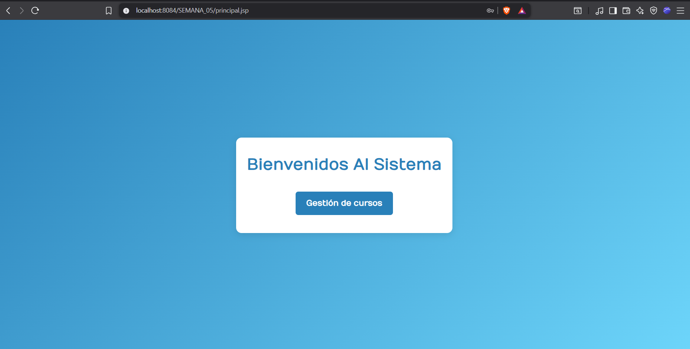
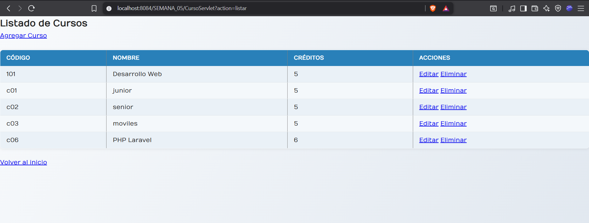
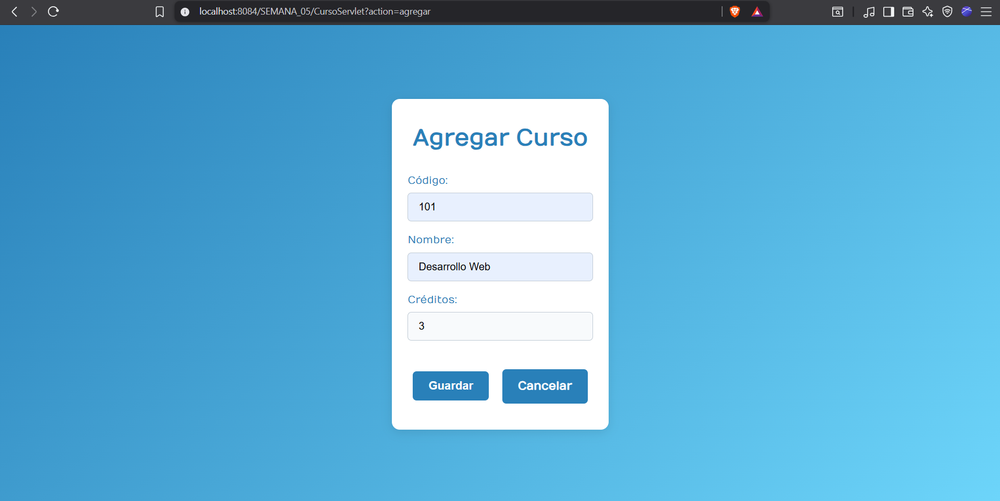
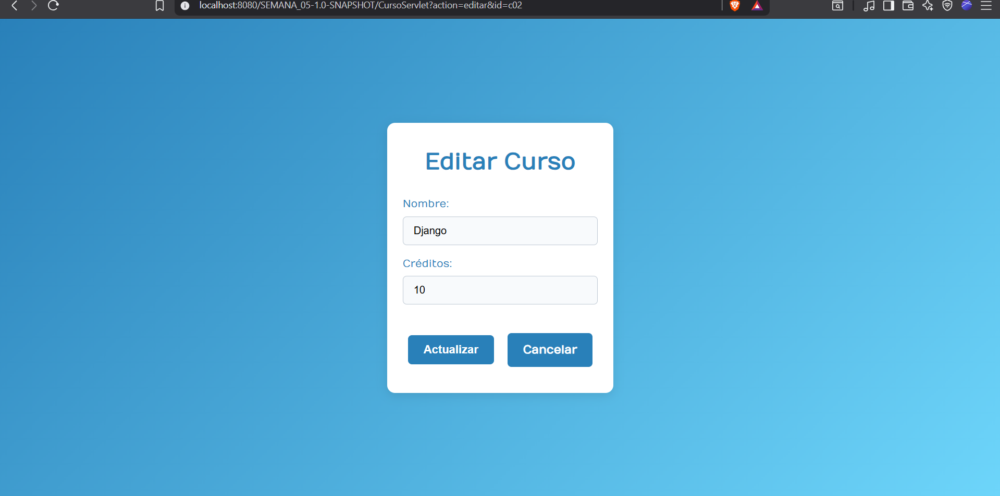
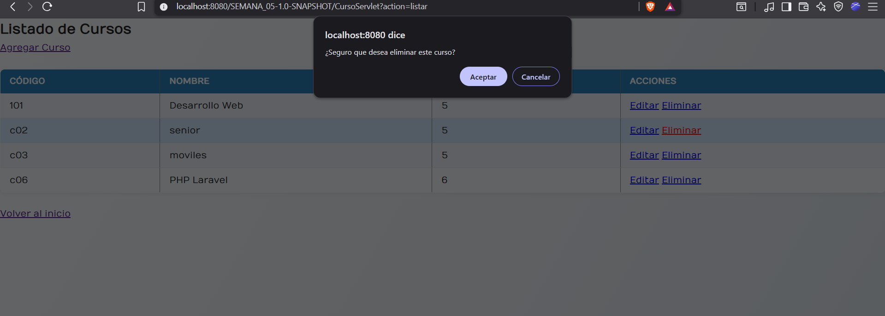

# 📘 Proyecto: Gestión de Curso (CRUD)

Este proyecto es una aplicación web desarrollada para la **gestión de cursos** que implementa las operaciones básicas de un **CRUD (Crear, Leer, Actualizar y Eliminar)**.  

El sistema permite:  
- 📌 **Agregar** un nuevo curso.  
- 📌 **Listar** todos los cursos disponibles.  
- 📌 **Editar** información de un curso existente.  
- 📌 **Eliminar** un curso.  

Está construido con **Jakarta EE**, **JSP**, **Servlets** y **JDBC**, utilizando un patrón de arquitectura basado en **DAO y MVC** para mantener una buena organización del código.  

---

## ⚙️ Características principales
- Gestión completa de cursos con interfaz sencilla.  
- Validación de datos en formularios.  
- Interacción con base de datos mediante JDBC.  
- Uso de JSP para la vista y Servlets para el controlador.  

---

## 📂 Evidencias del proyecto

### 🏠 Página Principal  

### 📑 Listado de Cursos  

### ➕ Agregar Curso  

### ✏️ Editar Curso  

### 🗑️ Eliminar Curso  

---

